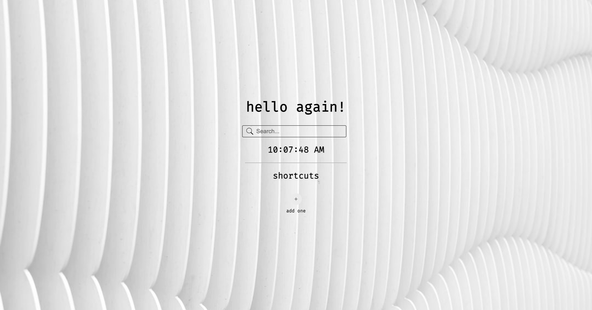

# new-tab-mono

### a simplistic minimalist new tab extension

### how to steal it and set it up

im flattered that you want to take my work

now heres how you use it

go to `chrome://extensions` and click the `Load unpacked` button in the top left

choose the folder where you have the repository cloned

you should see a new extension pop into existence

activate it if you havent already by clicking the toggle thingy

press the reload button next to it just in case

open a new tab and view ~~my~~ your work
